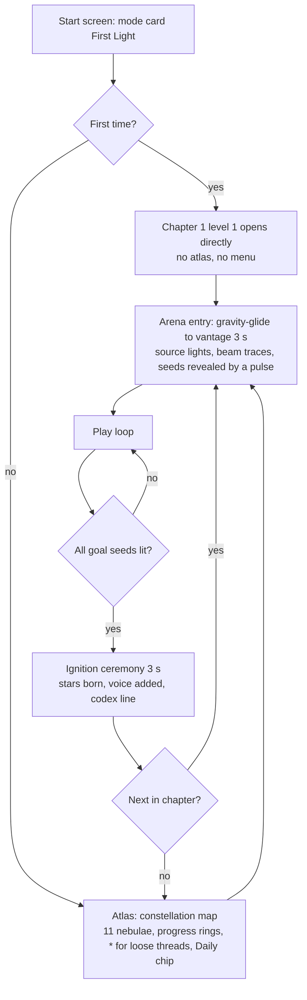
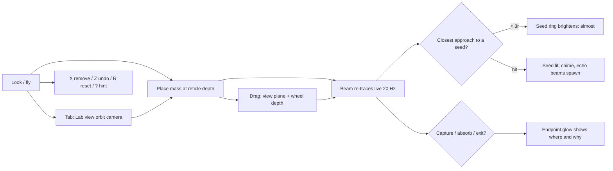
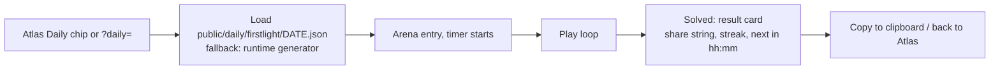

# 20 — First Light (puzzle) — design hand-off

*Build first. Depends on platform WP-0 … WP-9.*

> **First light** is what astronomers call a telescope's first image. In every nebula, dark
> seeds — protostars that never ignited — wait inside the structure. One star shines. You place
> a handful of gravitational lenses to bend its light around walls, through tunnels, off
> pearls and around black holes until every seed burns. Each star you light stays lit in the
> Voyage, forever.

---

## 1. Pitch, pillars, fantasy

**Genre:** calm first-person spatial puzzle. **Session:** 3–8 minutes per puzzle. **Length:**
64 authored puzzles in 11 chapters (5–8 hours), optional "Deep" mirrors, and a free 3-minute
daily. **Comparables:** The Talos Principle's connectors, Portal's single-tool clarity,
Monument Valley's tone, Marble Marcher's substrate, Outer Wilds' knowledge-as-progress.

Pillars (in priority order; when they conflict, the earlier wins):

1. **Showcase, don't stump.** Every puzzle reveals one true thing about light, gravity or the
   fractal it lives in. Eureka over fiero (Grant). No puzzle exists to pad time.
2. **One verb.** Place a mass. Dragging, undoing and removing are the same verb. Nothing
   needs orienting in 3-D.
3. **The beam is the interface.** Where light goes, why it stopped, how close it came: all
   visible in the world, never in a panel.
4. **No failure, no clock.** Monument Valley's contract. A captured beam is information, not
   punishment. Hints are opt-in and never spoil.
5. **Elegance is enforced.** The solver proves each puzzle needs its budget and cannot be
   solved by accident (Blow/ten Bosch; Viewfinder's lesson).

The player fantasy is not "engineer" but "the one who brings light": the ignition of each seed
is a small ceremony (3 s): the seed swells, the nebula's rim light flares along the beam's path,
the nebula's motif plays its next phrase, and a new star appears in the catalogue.

---

## 2. Rules

### 2.1 Objects

| Object | Behaviour | Visual |
|---|---|---|
| **Source** | Emits one beam in a fixed direction (`dir`). From chapter 8 some sources are *aimable*: the player places an **aim point** (same verb) and the source points at it. | A bright spiked star (existing nebula-star sprite) with a faint cone showing the emit direction. |
| **Beam** | A ray of light at unit speed. Absorbed by fractal surfaces; deflected by masses and black holes; reflected by pearls; filtered by veils; teleported by horizons. Intensity 1.0 at the source; each reflection ×0.7; a seed needs ≥ 0.3. | Warm white-gold core, cyan halo, additive, occluded by structure. Endpoint glows on the surface it hits. |
| **Seed** | Lit when the beam passes within its radius `r`. Kinds: `seed` (goal), `echo` (when lit, emits a new beam along `emit[0]`), `splitter` (emits along `emit[0..1]`), `hue` seeds want a colour. Lit state persists until the configuration changes. | Unlit: faint ember ring. "Almost": ring brightens as the beam's closest approach drops below 3r. Lit: teal bloom + glyph fill. Echo seeds show their emit arrow when lit. |
| **Mass** | A point lens with Schwarzschild radius ρ ∈ {light, medium, heavy} = level-defined (typically 0.4 %, 1 %, 2.5 % of the arena radius). Deflects by the exact Schwarzschild formula (§7.2 of the platform). **Capture:** a beam entering `r < 1.5ρ` inward is swallowed. Cannot be placed inside structure, outside the arena, or within 2ρ of another mass. | A dark sphere of radius ρ with a thin Einstein-ring rim that brightens as the beam passes closer. A drop line to the nearest surface while placing. |
| **Pearl** (Apollonian, Kleinian) | Surfaces of these two nebulae **reflect** specularly (normal from the DE gradient). Elsewhere surfaces absorb. | On reflection, a small flare at the contact point and a chime. |
| **Veil** | A translucent disc of coloured gas. A beam crossing it takes the veil's colour (white→red; red crossing blue → violet, additive in a 6-colour wheel). | Soft disc with Hubble-palette tint. |
| **Black hole** (Ouroboros, The Maw) | Real `rs`, real spin term. Capture at the photon sphere; Ouroboros is asymmetric (prograde bends more). A beam captured by The Maw exits from the Julia Veil's companion arena (the catalogue's `wormholeTo`). | The existing renderer. The beam's path is drawn through the lensing region exactly as the sky is bent. |
| **Arena** | A sphere in nebula-local units. Animation is frozen in all but the two "drift" levels. Soft bounds. | Nothing drawn; the HUD shows a faint horizon ring at the arena edge only in overview. |

### 2.2 Win

All `seed` objects lit with intensity ≥ 0.3 and (for hue seeds) the wanted colour. Echo and
splitter seeds are means, not goals, unless the level marks them as goals. The ignition
ceremony plays; the level is marked solved with the number of masses used (par ✦ when ≤ budget
minimum; the solver computes the minimum).

### 2.3 Budget

Each level grants masses by size (e.g. `{ light: 2, medium: 1 }`). The solver guarantees:
the level is unsolvable with any smaller multiset, the unlensed beam fails, and random
placement solves < 1 % of the time. Using fewer than the budget is possible in some levels and
rewarded with the ✦ mark (an optional Zachtronics axis; no leaderboard).

### 2.4 What is deliberately out

Timers, moving enemies, resource grind, colour mixing beyond the 6-colour wheel, orientation
handles, mirrors as placeable objects (the fractal is the mirror), Doppler colour, player-made
levels in v1 (the editor is the first post-launch feature, per Marble Marcher).

---

## 3. Content

### 3.1 Chapters (what each teaches, in order)

| # | Nebula | Chapter name | New rule | Puzzles | Notes |
|---|---|---|---|---|---|
| 1 | The Cauliflower (Mandelbulb) | **Bend** | A mass bends light toward itself; closer = harder. Capture. | 6 | Level 1: the unlensed beam misses the seed by one floret; one light mass fixes it (the "almost" moment, Traynor). Level 4 introduces capture by placing the seed directly behind where a mass would go: the player must bend *around*, not through. |
| 2 | The Menger Lattice | **Thread** | Line of sight through tunnels; two masses in series. | 6 | Levels 5–6 are **Deep**: the same tunnel family one scale down (self-similarity made literal; the HUD depth gauge reads "×3 deeper"). |
| 3 | The Pearl Foam | **Reflect** | Surfaces reflect; intensity ×0.7 per bounce. | 6 | A mass + a pearl = a "corner". |
| 4 | Sierpiński's Pyramid | **Echo** | Echo seeds relay the beam; four sub-pyramids each hide a seed. | 6 | Teaches order: which seed to light first. |
| 5 | Indra's Web | **Weave** | Reflections + echoes in a labyrinth; heavy masses; intensity budget (3 bounces max). | 6 | The hardest "pure geometry" chapter. |
| 6 | The Julia Veil | **Hue** | Veils colour the beam; hue seeds; splitters. | 6 | Colour is the only abstract rule in the game; introduce with a single veil and a single red seed. |
| 7 | The Frost Kaleidoscope | **Fold** | Masses are mirrored by the six-fold symmetry: place one, get six. Two "drift" levels where the slow spin (0.003 rad/s) opens a window every ~60 s (no fail; the beam simply lands when the alignment arrives). | 6 | The one fractal-native twist nobody else can ship. The codex explains the KIFS fold. |
| 8 | The Lichtenberg Nebula | **Branch** | Aimable sources (place the aim point); long echo chains along the dendrite. | 6 | Chains of 5–8 echoes; teaches planning backwards from the goal. |
| 9 | The Cathedral (Mandelbox) | **Cathedral** | Everything combined in vast halls. | 8 | Finishing 4 of 8 opens the black holes. |
| 10 | Ouroboros | **Ring** | Real lensing: hit a seed directly behind the hole by aiming off-centre; prograde vs retrograde (the same offset bends differently on each side); a photon-sphere loop (orbit once, exit). | 5 | The Einstein-ring shot is the game's signature image. |
| 11 | The Maw | **Beyond** | A beam into the horizon exits at the Julia Veil; two-arena puzzles; finale lights the "First Star". | 5 | Credits: the full score with every voice the player lit. |

Progression: chapters 1–3 open at once; each later chapter opens when 4 of 6 puzzles in any
two earlier chapters are solved (parallel lines, never a hard block: Monster's Expedition,
Talos 2's 8-of-10). Chapters 10–11 need 6 chapters at 4/6. The Atlas marks unexhausted chapters.

### 3.2 Deep variants

Twenty of the authored arenas have a Deep mirror: the same level geometry one or two
self-similar levels down (the Menger tunnel at 1/3 scale, the bulb floret on a floret), with a
different budget. They are optional, found by diving through the solved level's arena
(a faint beam continues downward), and they are the game's quiet statement about
self-similarity. The codex entry "Scale" completes when the player solves a Deep level.

### 3.3 Daily

One seeded puzzle a day (UTC), 1–3 masses, 1–3 seeds, from a rotating pool of 9 nebulae × 3–4
curated arenas. Difficulty by weekday (Mon–Tue 1 mass; Wed–Fri 2; Sat 3; Sun a Deep arena).
Unlimited attempts, time shown but not scored, share string:

```
First Light #42 · Menger · ◆◆◇  ⚬⚬  1:12
https://ticksterius-afk.github.io/fractal-nebulae/?mode=firstlight&daily=2026-10-02
```

(◆ = seeds lit, ⚬ = masses used, time to solve.) Streak stored locally. The daily is free on
the web forever and is in the Steam build too.

---

## 4. Flows

### 4.1 Session flow



### 4.2 Play loop (one puzzle)



### 4.3 Hint flow (opt-in only)

1. `?` or the hint chip (visible after 2 minutes on a level, never auto-opening).
2. **Hint 1 — easier deduction:** the designer's "first thing to notice" as one sentence
   ("The seed is behind the pillar. Light cannot go through; it can go around.").
3. **Hint 2 — region:** a translucent sphere (radius 6ρ) around one solution mass's position.
4. **Hint 3 — note:** the designer's note (full solution in words). Marks the level "solved
   with help" (no ✦). Chapters still progress.
Levels can always be skipped from the Atlas.

### 4.4 Daily flow



---

## 5. UI / UX

### 5.1 HUD (flight, playing)

```
┌───────────────────────────────────────────────────────────────────────────┐
│ THE MENGER LATTICE · THREAD 3 OF 6        ◆◆◇  seeds            * atlas  │
│ "Two Tunnels"                                                           │
│                                                                           │
│                                                                           │
│                         ·  ·  ·  (reticle)                                │
│                           ○  ← placement preview (green/red ring)         │
│                            ╵  drop line to surface                        │
│                                                                           │
│                                                                           │
│                                                                           │
│  physics tip (first time only)                 ┌──── codex card ────┐     │
│  "Light bends twice as much as Newton          │ Gravitational lens │     │
│   predicted. Eddington saw it in 1919."        │ α = 2 rₛ / b        │     │
│                                                └────────────────────┘     │
│                    ●  ●  ○        masses: light ×2 (1 left), medium ×1     │
│   Tab lab view · wheel depth · X remove · Z undo · ? hint     [fps 60]     │
└───────────────────────────────────────────────────────────────────────────┘
```

- The speed readout, throttle and autopilot chips are hidden in this mode (the ship still
  flies, slowly; cruise is capped at 0.3× in arenas).
- **Depth gauge:** while placing, a small vertical scale beside the reticle shows the depth
  as a fraction of the surface hit distance; the drop line shows the point's height above the
  nearest surface.
- **Seeds counter** uses ◆ (lit) ◇ (unlit); hue seeds show their colour.
- **Masses** as orbs: filled = available, hollow = placed. Clicking an orb selects the size for
  the next placement; `1 2 3` keys do the same.

### 5.2 Lab view (Tab)

Orbit camera around the arena centre, locked up, ghost x-ray so the beam is visible through
walls. The beam is drawn in full with small arrowheads every 10 % of its length; masses are
handles (drag in the view plane, wheel along the ray); seeds are diamonds; the arena horizon is
a faint ring. A **depth stack** chip shows "scale ×1 / ×3 / ×9" for Deep levels. Time does not
exist in this game, so nothing pauses; the lab view is simply another place to stand.

### 5.3 Atlas (between levels)

The start screen's attract render with the eleven nebulae as nodes of a constellation,
progress rings (solved/total), ✦ counts, asterisks for loose threads, the Daily chip with
"next in hh:mm" and the streak, and the codex entries unlocked so far. Hover a node: chapter
name, the rule it teaches, "resume" / "replay". Click: glide there.

### 5.4 Controls (added to the shared table)

| Input | Action |
|---|---|
| Left mouse (tap) | Place the selected mass at the preview point |
| Left mouse (hold on a mass) | Drag in the view plane; wheel moves it along the view ray |
| Wheel (no drag) | Placement depth ×1.15 per notch |
| 1 / 2 / 3 | Select light / medium / heavy |
| X | Remove the hovered mass (or the last placed) |
| Z / Shift+Z | Undo / redo |
| R | Reset the level |
| Tab | Lab view ⇄ flight |
| Backspace | Return to the vantage |
| Space | Pulse: reveal all seeds and masses as HUD markers for 10 s |
| ? | Hint ladder |
| Esc | Pause (settings, controls, Atlas) |

### 5.5 Visual language

The Voyage's tokens: Rajdhani caps, JetBrains Mono values, cyan accent `#7fe7ff`, glass cards.
The beam is the only warm element on screen until a seed ignites (teal bloom, then the
nebula's palette floods the rim light along the beam). Masses are the only pure blacks.
"Almost" is communicated by brightness, never by numbers. Everything new is a sprite or a line
in the depth-tested sprite layer; no new raymarch passes.

### 5.6 Audio

- Beam hum: a soft bowed tone in the nebula's key whose pitch rises with total deflection and
  whose timbre brightens per reflection.
- Seed lit: the next scale degree (ascending through the chapter, so a chapter is a melody).
- Capture: a low swallow + the hum dropping an octave. Absorb: a dull tick at the hit point.
- Ignition: the nebula's motif (from `motifs.ts`), and the lit seeds become persistent voices in
  the Voyage profile for that nebula (`GameAudio.addVoice`).
- Every cue has a visual twin (rim flare, endpoint glow, glyph fill).

---

## 6. Teaching

- **Level order teaches; text never does.** Each chapter: a "show" level (the rule happens by
  itself), two "use it" levels, two "combine" levels, one "surprise" (an assumption broken:
  e.g. chapter 1's capture level). Traynor's smoothing tools apply: insert, modify, delete,
  reorder, optionalise.
- **Physics tips** (one line, first time only, existing HUD mechanism) at the first bend, the
  first capture, the first reflection, the first Einstein ring, the first wormhole.
- **Codex threads** per chapter: "Lensing", "Photon sphere", "Reflection", "Relays", "Colour of
  light", "Symmetry", "Frame dragging", "Einstein ring", "Horizons". Each completed thread
  shows one formula and one sentence of history (Eddington 1919, Chwolson 1924, Einstein 1936).
- **Playtesting protocol:** five narrated video playtests per chapter with fresh players
  before authoring the next chapter; a level where most testers feel "relief, not eureka" is
  re-presented, not made easier (Taiji's rule).

---

## 7. Technical design

### 7.1 Modules

```
src/game/firstlight/
  FirstLightMode.ts      // GameMode: state machine (atlas / entering / playing / ignition / result)
  Level.ts               // schema, loader, validation (zod-free: hand-written sanitiser like settings)
  BeamTracer.ts          // uses platform Tracer + Geodesic; produces BeamResult
  Objects.ts             // runtime objects, lit-state resolution, echo queue
  Rules.ts               // win check, budget, par, hue wheel
  DailyGen.ts            // forward-design generator (shared with tools/daily-build.ts)
  hud/                   // HUD DOM, atlas map, result card, hint chip
  levels/<chapter>/<nn>.json
tools/firstlight-solve.ts   // solver + accidental-solution density + robustness
tools/firstlight-check.ts   // all authored levels: solvable, minimal budget, deterministic
```

### 7.2 Level schema

```jsonc
{
  "id": "menger-03", "chapter": "menger", "index": 3, "name": "Two Tunnels",
  "nebula": "menger",
  "arena": { "centerLocal": [0.31, -0.02, 0.44], "radiusLocal": 0.09, "freezeAnimation": true,
             "vantageLocal": { "pos": [0.31, 0.05, 0.60], "lookAt": [0.31, -0.02, 0.44] } },
  "scaleBand": 1,                                  // 1, 3, 9 for Deep variants
  "source": { "posLocal": [0.26, 0.00, 0.40], "dir": [0.9, 0.1, 0.42], "aimable": false, "colour": "white" },
  "seeds": [
    { "id": "a", "posLocal": [0.36, -0.03, 0.47], "radius": 0.0025, "kind": "seed", "wants": "white", "goal": true },
    { "id": "b", "posLocal": [0.33, 0.01, 0.50], "radius": 0.0025, "kind": "echo", "emit": [[0.2, -0.9, 0.3]], "goal": false }
  ],
  "veils": [],
  "masses": { "light": 0.0004, "medium": 0.0010, "heavy": 0.0025 },   // ρ, local units
  "budget": { "light": 2, "medium": 0, "heavy": 0 },
  "solution": [ { "size": "light", "posLocal": [0.30, 0.00, 0.455] }, { "size": "light", "posLocal": [0.34, -0.01, 0.49] } ],
  "hints": [ "The second tunnel does not line up with the first.", "", "Bend once into the first tunnel, once more at its mouth." ],
  "teach": "Two bends in series add.", "codexThread": "lensing",
  "deep": { "of": "menger-02", "band": 3 }        // optional
}
```

`Level.sanitize()` rejects anything out of range (positions outside the arena, ρ > 5 % of the
radius, more than 16 seeds, more than 6 budget items).

### 7.3 Beam tracing

```
trace(level, masses) → BeamResult {
  beams: { points: Float32Array (local), colour: RGB, intensity: number, events: Event[] }[],
  seedState: Map<id, { lit: boolean; intensity; colour; closest: number }>,
  masses: { ringGlow: number }[]   // closest approach per mass for the Einstein rim
}
```

- Queue of pending beams starting with the source; max 16 beams, 6 reflections per beam,
  4,000 steps per beam, total steps ≤ 30k (≈ 10–20 ms worst case on the main thread).
- Step size: `min(0.8·DE(p) − eps, 0.15·r_nearestMass, 0.02·arenaRadius)`; near masses the
  geodesic RK2 integration; elsewhere straight (a = 0 skips the integrator).
- Per step: update `closest` for every unlit seed (cheap: ≤ 16 seeds), test seed hit
  (`|p − s| < r`), surface hit (`DE < eps` → absorb or reflect by nebula material), veil crossing
  (segment/disc intersection), arena exit, capture, max length.
- Black holes: the arena contains the catalogue black hole; use its runtime `rs`, spin, and the
  renderer's exact spin term (platform §7.2). Capture by The Maw → continue the beam from the
  companion arena's entry point with the same direction (the level defines `wormhole.exitLocal`).
- **Live retrace:** while dragging, retrace at 20 Hz with step ×2 and total steps ≤ 10k; on
  release, a full trace. If the full trace exceeds 8 ms three frames running, move tracing to
  a worker (the tracer is pure; the main thread keeps the last result).
- Determinism: positions quantised to 1e-6 local before tracing; the same level + masses
  must yield identical `seedState` in Node and the browser (`tools/firstlight-check.ts`).

### 7.4 Solver and generator

**Solver** (`tools/firstlight-solve.ts`), offline:
1. Candidate positions: 3k blue-noise points in free space of the arena (DE > 3ρ_max).
2. For budget multisets up to size 3: beam-guided pruning (a mass only matters within 20ρ of
   the current beam; enumerate candidates near the beam first), then exhaustive within the
   pruned set; sizes 4+ use simulated annealing from the authored solution.
3. Report: minimal budget, solution count at tolerance (distinct solutions after clustering
   at 2ρ), **accidental density** (fraction of 500 uniformly random budget placements that
   solve; must be < 1 %), **robustness** (the authored solution still solves when every mass
   is jittered by 5 % of ρ, 50 trials; must be ≥ 90 %), beam length, reflections.
4. CI gate: every authored level passes or the build fails.

**Daily generator** (`DailyGen.ts`, forward design):
1. From the seed: nebula (rotating), curated arena, weekday difficulty → mass count k.
2. Place k masses in free space, choose a source direction that passes within 12ρ of the
   first mass, trace.
3. Place seeds on the traced path **after** the first deflection (so the unlensed beam fails),
   1–3 of them, preferring points right after bends and near structure (the beam should look
   like it threads something).
4. Remove the masses, verify: unlensed beam fails; accidental density < 1 % (150 trials);
   robustness ≥ 90 %; path length within [0.5, 3] × arena radius; ≥ 1 "almost" (unlensed
   beam passes within 3–8 r of a seed) for the Mon–Tue tiers.
5. Retry up to 200 attempts with sub-seeds; emit the level JSON. Build-time script writes 400
   days; runtime fallback uses the same code.

### 7.5 Rendering

- Beams: `LineSystem` ribbons, width 2.5 ref px, HDR colour `(2.4, 1.9, 1.2)` core with a
  `(0.5, 1.6, 1.8)` halo (Voyage accent), intensity modulates both; arrowheads in lab view.
- Seeds, masses, veils: `GlyphSprites` (ring, diamond, disc) + `NebulaStars`-style spiked
  sprites for lit seeds; the Einstein rim is a ring glyph whose width follows `ringGlow`.
- Lit seeds and beam endpoints feed the nebula material's **accent lights** (max 4 by distance).
- Ignition: a 3 s sequence: accent light ramps, a local pulse (existing `state.pulse` with a
  small radius), the lit seed is appended to the nebula's `lights[]` for the rest of the session
  (and persisted: the Voyage adds a small star sprite at that local position when the level is
  solved — "each star you light stays lit").

### 7.6 Persistence

`progress.firstlight = { solved: { [levelId]: { masses: number; help: boolean; par: boolean } },
daily: { streak, last, history: { [date]: { time, masses } } }, threads: string[] }`.

### 7.7 Performance

Arenas are small, so the nebula pass is at its cheapest (high LOD, few steps). Target: 60 fps
on High at 2560×1440 dynamic res with a 16-beam weave; lines and glyphs ≤ 0.5 ms; trace ≤ 8 ms
peak on the main thread, else worker. Low preset: identical gameplay.

### 7.8 Tests

- `tools/firstlight-check.ts`: all levels load, sanitise, solve with their budget, fail with
  less, meet density/robustness; determinism across two runs; prints a table.
- `tools/daily-build.ts --mode firstlight --days 400`: all days generated and validated.
- GLSL checks for LineSystem, GlyphSprites, accent lights.
- Browser pass with the dev rig: place/drag/undo at 60 fps; lab view orbit; ignition.

---

## 8. Work packages

| WP | Deliverable | Acceptance |
|---|---|---|
| FL-1 BeamTracer (headless) | tracer over platform Tracer/Geodesic; seeds, echoes, reflection, veils, capture; `BeamResult` | far-field deflection 2 %; reflection symmetric; 1k random configs deterministic; ≤ 20 ms worst case |
| FL-2 Level schema + Arena entry | `Level.ts`, sanitiser, loader, arena entry glide, source/seed/mass runtime | a hand-written level loads; the ship arrives at the vantage |
| FL-3 Placement + lab view | mass placement via platform Placement; drag; undo stack; lab view with ghost x-ray; depth gauge | 60 fps; legality rings correct; undo/redo 50 deep |
| FL-4 Rendering | beam ribbons, glyphs, Einstein rims, accent lights, ignition sequence | occlusion correct; ignition reads clearly in a 3 s screenshot series |
| FL-5 Chapter 1 + solver | six Cauliflower levels authored with the solver; hint texts; physics tips; **M1 playtests** | all six pass the solver gates; 5 narrated playtests recorded and summarised |
| FL-6 Daily + share + atlas | DailyGen, build-time generation, result card, share string, streak, atlas map with progress and threads | 400 dailies validated; share string copies; atlas shows loose threads |
| FL-7 Chapters 2–9 | 50 levels + Deep variants (20) | solver gates; per-chapter playtests |
| FL-8 Black holes | arena black holes, spin term mirror, wormhole continuation, chapters 10–11 | beam path matches the rendered lensing to the eye; Einstein-ring level solvable |
| FL-9 Polish | hint ladder, audio, codex threads, Voyage persistence of lit stars, settings, accessibility pass | no auto-popping hints; every cue has a visual twin |
| FL-10 Release | Electron build, Steam page, demo (chapter 1 + daily), soundtrack app, supporter pack | see `50-release-and-monetization.md` |

---

## 9. Monetization (specific)

Free on the web: the daily and chapter 1 (six levels) — the Townscaper pattern, feature-limited
not time-limited. Premium (Steam + itch): all chapters, Deep variants, the Atlas, Plate mode,
achievements (one per chapter, one per Deep, one for a 30-day streak), cloud saves.
**$12.99**, launch discount 10 %. Soundtrack app "First Light — Album Mode" $4.99 (fixed-seed
renders of each chapter's score plus the finale with all voices, FLAC depot, also on Bandcamp).
Supporter pack $4.99: 4K plates of the eleven ignition moments, dome/fisheye plate export, a
name in the credits. Level-pack DLC ($4.99–6.99) only if the base game clears Silver.

---

## 10. Risks and mitigations

| Risk | Mitigation |
|---|---|
| 3-D disorientation in self-similar arenas | Small arenas (≤ 0.1 of the bound), the beam as landmark, lab view, Backspace to vantage, no forced camera motion, comfort FOV |
| Shallow puzzles behind a pretty mechanic | Solver gates (minimal budget, accidental density, robustness); "describe the solution in a sentence" rule; playtests per chapter before the next |
| Depth placement feels fiddly | Default depth = half the hit distance; drop line; wheel log steps; snap-to-beam option (hold Ctrl: the point snaps to the nearest beam point, then wheel offsets perpendicular) |
| DE unreliable in some regions | Curated arenas only; `tools/sites-check.ts` reliability gate |
| Trace cost spikes in weave levels | Live retrace at coarse steps; worker fallback |
| Daily too easy / too hard | Weekday tiers; 400-day validation reports difficulty stats (path length, bends, accidental density) and the generator rejects outliers |
| "Just a website in a window" on Steam | Achievements, cloud saves, overlay, controller scheme; the premium build has 10× the content of the web demo |

---

## 11. Open questions

- Should Deep variants be gated or free? Current answer: free, found by diving.
- Two "drift" levels in chapter 7 introduce time; keep only if playtests show delight, else cut.
- Aimable sources (chapter 8) are the one place the player sets a direction (via a placed aim
  point). If testers struggle, replace with pre-aimed sources and more echoes.

---

## 12. Success criteria

- M1: ≥ 4 of 5 fresh testers solve chapter 1 unaided and describe a rule they learned in
  their own words.
- Daily: measurable organic traffic (GitHub Pages bandwidth, referrals) within a month of M2;
  at least one community post the author did not write.
- Steam: 7–10k wishlists before launch; demo peak CCU ≥ 70 (the ×3 rule predicts a Silver launch).
