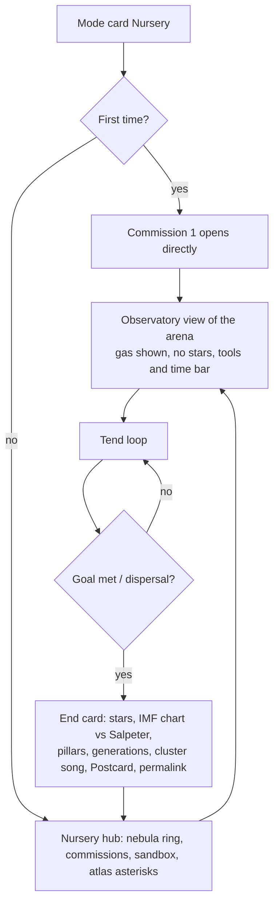
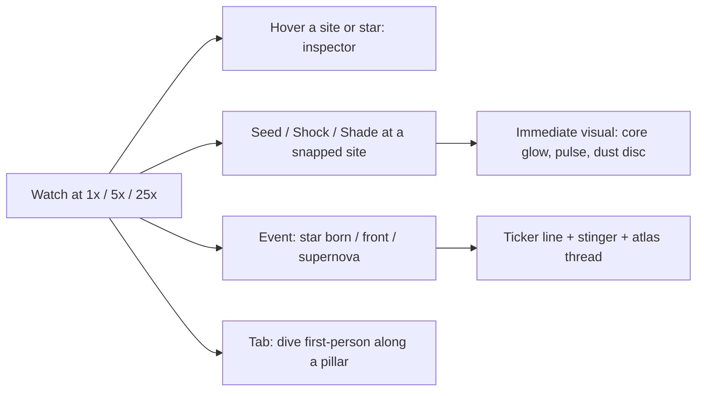

# 30 — Nursery (simulation) — design hand-off

*Build third. Depends on platform WP-0 … WP-9 and on First Light's accent lights and glyphs.*

> Nebulae are where stars are born. In Nursery you tend one. Seed a dense core, send a shock
> through the gas, shade a ridge from a young star's wind, and let time run. Pillars carve
> themselves where your shadows fall; a supernova lights a second generation on the far side of
> the lattice; and when the gas is spent, a cluster blazes where there was only dust. Every star
> you made has a voice.

---

## 1. Pitch, pillars, fantasy

**Genre:** systems toy with goals; a star-formation simulation on a fractal cloud.
**Session:** 20–40 minutes per commission; open sandbox. **Comparables:** Eufloria's ambient
growth, Townscaper's toy-with-recipes, Terra Nil's rhythm, Universe Sandbox's "what if" (with
the explanation it lacks), Fract OSC's world that wakes with sound.

Pillars:

1. **Honest, simplified astrophysics.** Jeans collapse, Strömgren spheres, photoevaporation,
   wind bubbles, triggered star formation, the initial mass function, supernova feedback. The
   codex shows the real relation each rule simplifies.
2. **Your touch changes the nebula visibly.** Gas depletes, fronts advance, pillars survive in
   your shadows, stars ignite along the fractal's ridges. No progress bars.
3. **Toy first, goals on top.** Sandbox is complete without goals; commissions and the Atlas add
   them (Islanders, Dorfromantik's modes).
4. **Geometry is the strategy.** The Menger lattice spreads fire everywhere; the Pearl Foam
   isolates every pearl; the Lichtenberg tree chains along branches. Same rules, different games.
5. **The cluster is a score.** Massive stars are low brass, small stars are high bells; a
   supernova is a toll. The mass function is a chord you can hear.

---

## 2. Simulation model ("the Cradle")

### 2.1 Substrate

A `SiteSet` in the `shell` band (gas region `0 < DE < 0.15 × bound`) plus the `surface` band,
20–30k sites per nebula arena, kNN `k = 10`, neighbour distances. Everything below is per site.

```ts
state: { gas: f32 /*0..1*/, temp: f32 /*0..1*/, ion: f32 /*0..1*/, shock: f32 /*0..1, decays*/,
         phase: u8 /*GAS, CORE, PROTO, STAR, REMNANT, VOID*/, mass: f32 /*M☉, stars*/, age: f32 /*Myr*/,
         shadow: f32 /*0..1 fraction of nearby stars occluded*/ }
```

Initial `gas` = designer multiplier × (0.4 + 0.6·trap.y cavity) × (0.8 + 0.4·noise); the
cavities of the fractal are naturally the dense cores.

### 2.2 Clock

Sim tick 10 Hz. At speed 1×, one real second = 0.05 Myr (a 30-minute session spans ~90 Myr at
1×, far less with pauses; 5× and 25× exist for waiting). All rates below are per Myr.

### 2.3 Rules (applied each tick in this order)

1. **Thermal:** `temp → ambient (0.1)` with τ = 0.5 Myr; ionised gas has `temp ≥ 0.8`.
2. **Jeans collapse:** a GAS site with `gas > J` becomes CORE, where
   `J = 0.55 + 0.4·temp − 0.3·shock` (hot gas resists; shocked gas collapses easily). The
   core's reservoir = sum of `gas` over its kNN within radius `R_acc`.
3. **Core → protostar** after the free-fall time `t_ff = 0.3 / sqrt(reservoir)` Myr (0.1–1 Myr).
4. **Protostar → star** after accretion `t_acc = 0.5 + 0.1·mass` Myr; the final mass is drawn
   from a Salpeter-like law truncated by the reservoir: `P(m) ∝ m^−2.35`, `m ∈ [0.1, min(60, 20·reservoir)]`.
   Accretion removes `gas` from the kNN ring proportionally.
5. **Radiation:** a STAR of mass `m` has `L ∝ m^3.5`; its Strömgren radius `R_S = r0·L^(1/3)`.
   Sites within `R_S` whose line of sight to the star is **clear** (shadow computed by one
   trace per site-star pair, cached per 0.5 Myr) become ionised (`ion → 1`, `temp → 1`) and
   **photoevaporate**: `gas −= 0.4·(1 − shadow)` per Myr. Shadowed sites keep their gas:
   **pillars** form on ridges facing the star. Stars below 2 M☉ have negligible `R_S`.
6. **Wind:** stars above 8 M☉ push a shell outward at `v_w` (shell radius grows with
   `sqrt(t)`); sites the shell crosses get `shock = 1` (triggered collapse beyond) and lose
   20 % of gas (swept).
7. **Lifetime:** `t_life = 10⁴ · m^−2.5` Myr (10 Myr at 16 M☉, 3 Myr at 25 M☉, ~1 Gyr at 1 M☉).
   Stars above 8 M☉ end in a **supernova**: a shock shell expanding at 0.1·bound/Myr decaying
   over 2 Myr: within `R₁` gas is stripped to VOID; in the shell `shock = 1`; the site becomes a
   REMNANT (neutron star < 25 M☉, black hole ≥ 25 M☉: a tiny lensed glyph). Below 8 M☉ stars
   outlive the session.
8. **Dispersal:** when total `gas < 5 %` of the initial, the cradle is spent → end card.

### 2.4 Player tools (budgets per commission; unlimited in sandbox)

| Tool | Effect | Cost model |
|---|---|---|
| **Seed** (click a site) | Sets `gas` at the site and its kNN ring to `J + 0.1` and `shock = 0.5` → a core forms within one tick. | 1 seed charge |
| **Shock** (click a point) | A spherical pulse (the Resonance Pulse's visuals and `state.pulse`) expands from the point to radius `R` over 4.5 s real time; sites it crosses get `shock = 1`; thin gas (`< 0.2`) in its wake is dispersed. | 1 shock charge |
| **Shade** (click a site) | A dust lane: a disc of radius `R_sh` with normal toward the nearest massive star, placed on the site; it counts as opaque for radiation traces. | 1 shade charge |
| **Time** | 0 / 1× / 5× / 25×. In Phase 2: a "well" setting (×100) available only while the Observatory is moored inside a black hole's dilation band in the Voyage; honest GR: your clock slows, the nebula races. | free |

Every tool is a point placed with the platform primitive, snapped to sites. Nothing needs a
direction (shade normals are automatic).

### 2.5 Geometry twists (the same rules, different behaviour)

| Nebula | Behaviour |
|---|---|
| Menger Lattice | Everything is connected; fronts and shocks travel the tunnels; isolation is impossible, timing is everything. |
| Pearl Foam | Each pearl is its own cradle; only shocks cross the gaps; chain reactions must be *aimed*. |
| Lichtenberg | Linear: one branch at a time; a supernova at a fork lights both arms. |
| Sierpiński | Four self-similar nurseries; the central void shields them from each other. |
| Cauliflower | Florets as separate cradles with thin necks; photoevaporation sculpts the necks into pillars. |
| Cathedral | Vast halls: Strömgren spheres are huge; pillars are the only shade. |
| Julia Veil | The veil's `c` wanders (1200 s loop): gaps open and close; animation is **not** frozen here. |
| Indra's Web | Spiral channels funnel shocks; a supernova spirals outward. |
| Frost Kaleidoscope | Six-fold symmetry: a seed in one arm mirrors in all six (commissions use it). |

---

## 3. Content

### 3.1 Modes

- **Sandbox:** any nebula, unlimited tools, time control, Postcard, permalink replay.
- **Commissions:** scenarios with budgets and goals, 20–40 min, three stars (goal, par
  budget, par time), unlock order loose (any 2 of 3 open the next trio).
- **Atlas:** phenomena as loose threads per nebula.

### 3.2 Commissions (first set of 12)

| # | Name | Nebula | Goal (predicate on sim state) | Teaches |
|---|---|---|---|---|
| 1 | First Light | Cauliflower | Form one star. | Seed → core → protostar → star |
| 2 | Pillars | Cauliflower | Keep ≥ 3 pillars (sites with `gas > 0.5` inside an O star's `R_S` for ≥ 5 Myr). | Shadowing, photoevaporation |
| 3 | Quiet Cradle | Pearl Foam | 20 stars, none above 8 M☉. | The IMF, restraint, reservoirs |
| 4 | Cascade | Menger | ≥ 3 generations triggered from one supernova. | Triggered star formation |
| 5 | Salpeter | Cathedral | ≥ 40 stars whose mass histogram matches Salpeter within tolerance (KS-like score ≥ 0.8). | The initial mass function |
| 6 | Branch Fire | Lichtenberg | Light every branch tip within 30 Myr with ≤ 3 seeds. | Propagation along the dendrite |
| 7 | Four Nurseries | Sierpiński | A cluster in each sub-pyramid, none touching. | Isolation by geometry |
| 8 | Veil Window | Julia | Trigger collapse across the veil's gap during the window. | Timing with a breathing world |
| 9 | Snowflake | Frost | A symmetric cluster (six-fold). | Symmetry |
| 10 | Spiral | Indra's Web | A supernova whose shock lights ≥ 8 cores along one spiral. | Channels |
| 11 | Sixty Suns | Cathedral | Produce a 60 M☉ star and survive its death with ≥ 10 stars intact. | Massive stars, feedback |
| 12 | Last Light | Menger | Spend the gas with the highest star count. | Efficiency; the dispersal end |

### 3.3 Atlas threads (phenomena; each shows the maths)

First core (Jeans mass), first protostar (free-fall time), first star by class (O B A F G K M
with temperature colours), Strömgren sphere, pillar, wind bubble, triggered generation,
supernova, remnant (neutron star / black hole), runaway cluster dispersal, the IMF histogram
("your cluster vs Salpeter"). Each unlock captures a **plate** (the moment's render) and adds
a voice to the nebula's Voyage profile.

---

## 4. Flows





---

## 5. UI / UX

### 5.1 Observatory view (default)

```
┌────────────────────────────────────────────────────────────────────────────┐
│ THE CAULIFLOWER NEBULA · PILLARS       12.4 Myr   ★ 7 stars   gas 61 %     │
│ goal: 3 pillars for 5 Myr  ▮▮▮▯▯  (2 holding)                              │
│                                                                            │
│          (orbit camera on the arena; gas tinted; stars as spiked sprites;  │
│           ionisation fronts in Hα orange; shadowed gas stays teal;         │
│           pillars rim-lit; a shock shell expanding)                        │
│                                                                            │
│                                  ┌ inspector (hover) ─────────────┐        │
│                                  │ B2 star · 9.1 M☉ · 2.3 Myr      │        │
│                                  │ R_S 0.021 · dies in 23 Myr      │        │
│                                  └─────────────────────────────────┘        │
│  ticker: "Supernova in the eastern floret — 3 cores triggered"             │
│                                                                            │
│   ◉ seed ×2   ◎ shock ×1   ◍ shade ×3        ‖  ▶ 1×  5×  25×   P plate     │
│   Tab dive · wheel zoom · RMB orbit · ? atlas                   [fps 60]    │
└────────────────────────────────────────────────────────────────────────────┘
```

- Tools are chips with remaining charges; `1 2 3` select; click a site to apply; a hovered
  site shows its snap ring and, for Seed, a preview of the reservoir (the kNN ring brightens).
- Time bar: pause/1×/5×/25×; the epoch in Myr; the sim pauses automatically while a tool is
  being aimed (Terra Nil's calm), resumes on commit.
- Inspector: hover a star (class, mass, age, `R_S`, fate), a site (gas, temp, ionised,
  shadowed by whom), a remnant. Numbers only here, never on the field.
- Ticker: one line, at most one per 10 s, for events the camera did not see.
- Goals as segmented bars; stars (✦) on the end card.

### 5.2 Dive (Tab)

First-person flight inside the arena (slow cruise), to look along a pillar or sit inside a
Strömgren sphere. Tools work here too (reticle placement, snapped). The HUD keeps the time bar
and tool chips; the inspector follows the reticle.

### 5.3 Hub

The eleven nebulae as a ring; each shows commissions (✦ counts) and atlas asterisks; sandbox
button; the Atlas drawer with plates; "Postcards" gallery (local).

### 5.4 Controls

| Input | Action |
|---|---|
| Right mouse drag | Orbit (locked up) · wheel: dolly · Shift+drag: pan focus |
| Left mouse | Apply the selected tool at the snapped site (preview ring first) |
| 1 / 2 / 3 | Seed / Shock / Shade |
| Space | Pause/resume time · `[` `]` slower/faster |
| Tab | Dive ⇄ Observatory |
| P | Plate mode (Postcard) |
| ? | Atlas |
| Z | Undo the last tool use within 2 s of real time (a mercy undo; the sim rewinds one tick buffer) |

### 5.5 Visual language

Hubble palette by physics: ionised gas Hα orange-pink, neutral shadowed gas teal (OIII),
dust lanes dark with rim light, stars by blackbody colour and size by luminosity (existing
sprite system), cores a dim red-orange cocoon, protostars flicker, supernova = the existing
pulse shell in the nebula's `glowNear`, remnants tiny glyphs (neutron star: cross; black hole:
a small lensed dot using a ring glyph). Pillars need nothing new: shadowed gas keeps its density
in the gas mask, so the existing rim light does the work.

### 5.6 Audio

Each star is a voice (`GameAudio.addVoice`): pitch = scale degree by log mass (massive = low),
timbre by class (O/B brass pads, A/F bells, G/K/M plucks); protostars breathe (filtered
noise); fronts add a slow shimmer; supernova = toll + pulse SFX; dispersal = the voices fade
into the Voyage profile for that nebula. Cap 24 individual voices; beyond, stars join a
"choir" layer whose density follows the count. Every cue has a visual twin.

---

## 6. Teaching

- Commission 1 is the only scripted sequence: one seed, watch 2 Myr at 5×, the star ignites,
  the first atlas thread completes with "Jeans mass" shown as the relation it simplifies.
- Each atlas thread shows: the rule as implemented (one line), the real relation (one line),
  one sentence of context (Jeans 1902, Strömgren 1939, Elmegreen & Lada 1977 for triggered
  formation, Salpeter 1955), and the plate.
- Universe Sandbox's lesson: never leave a phenomenon unexplained; the inspector always names
  what it shows.
- Hints: commissions carry three escalating hints via the platform ladder ("Pillars survive
  where light cannot reach"; "Shade the ridge facing the O star"; the note).

---

## 7. Technical design

### 7.1 Modules

```
src/game/nursery/
  NurseryMode.ts        // state machine: hub / observing / diving / end card
  Cradle.ts             // the sim (pure, typed arrays, seeded), tick(dtMyr)
  CradleRules.ts        // constants + rule functions (unit-testable)
  Radiation.ts          // star→site shadow cache (traces), Strömgren radii
  GasMask.ts            // splat sites → 64³ RG8 texture (local space), upload ≤ 4 Hz
  StarVoices.ts         // GameAudio mapping
  Commissions.ts        // goal predicates, star ratings, hints
  commissions/*.json
  hud/                  // observatory HUD, inspector, ticker, hub, end card (IMF chart)
tools/cradle-check.ts   // headless: invariants, IMF shape, commission solvability by a scripted bot
```

### 7.2 Sim implementation

- Main-thread sim at 10 Hz with a 2 ms budget (20–30k sites × simple rules ≈ 1–2 ms in JS);
  time-slice across frames at 25× (the tick count per frame scales, cap 6 ticks/frame, show a
  subtle "catching up" state if capped).
- Radiation shadows: per star, trace to sites within `R_S` once per 0.5 Myr of sim time, in a
  worker (`Tracer.segment` on a copy of the arena's DE parameters); results cached as a bitset;
  shades add disc intersections. Budget: 24 stars × ~500 sites = 12k traces per refresh ≈ 0.3 s
  in the worker.
- Determinism: seeded PRNG per commission seed; the action log (tool, site, tick) replays the
  whole session → permalink = seed + compressed action log (base64url, typically < 300 bytes).
- Undo: a 20-tick ring buffer of state (30k sites × 32 B × 20 ≈ 20 MB); the mercy undo pops to
  the tick before the action.

### 7.3 Rendering

- **Gas mask** (new shader path in `NebulaMaterial`): `uniform sampler3D uGasMask` (RG8, 64³,
  nebula-local box = the arena's bounding cube), sampled in the gas integration:
  `density *= R`, `tint = mix(neutralTint, ionisedTint, G)`. `#define GAS_MASK 1` only in this
  mode; cost +5–10 % of the nebula pass (16 samples/ray). Low preset: 32³ and 8 samples.
  Splat: each site deposits `gas` and `ion` with a 3-cell Gaussian footprint; normalise by a
  precomputed site-density texture so uneven sampling does not show. Validate with
  `tools/check-all-shaders.ts`.
- Stars: `NebulaStars` sprites with colour by temperature, size by `L^0.25`; protostars a
  dim flickering sprite + cocoon glyph; cores ring glyphs; remnants glyphs; shades disc glyphs.
- Shock shells: `state.pulse` (one at a time; queue if several; a supernova and a player shock
  may overlap: allow 2 pulses by extending the uniform to `vec4[2]`).
- Accent lights: the 4 brightest stars nearest the camera light the structure.

### 7.4 Data

`commission.json`: nebula, arena, initial gas multiplier, budgets, goals
(`{ type: 'stars' | 'pillars' | 'generations' | 'imf' | 'survive' | 'tips' | 'symmetry', … }`),
par budget/time, hints, codex thread ids. `progress.nursery`: commissions solved with stars,
atlas threads, postcards (permalinks + thumbnails as data URLs, capped at 24).

### 7.5 Tests

- `tools/cradle-check.ts`: 10k ticks on three arenas: no NaN, gas monotone non-increasing
  except by tools, IMF slope within [−2.6, −2.1] over 200 stars, supernova shells trigger ≥ 1
  collapse on average in dense arenas; commissions 1–6 solvable by a scripted bot within par.
- GLSL checks for the gas mask; perf check: nebula pass delta ≤ 10 % on High.
- Browser pass: a 30-minute sandbox session at 25× without GC hitches > 20 ms.

---

## 8. Work packages

| WP | Deliverable | Acceptance |
|---|---|---|
| N-1 Cloud sites | `shell` + `surface` site sets for three arenas; `deTrap` done (platform WP-3) | sets precomputed; reliability gate |
| N-2 Cradle core | `Cradle.ts`, rules, PRNG, action log, replay; headless harness | invariants pass; IMF shape; determinism |
| N-3 Stars + inspector | sprites by class, glyphs, inspector DOM, ticker | reads correctly in overview and dive |
| N-4 Gas mask | 3-D texture path in the nebula shader, splatting worker | shader check; cost ≤ 10 %; pillars visibly survive in shadow |
| N-5 Tools + time | seed/shock/shade via Placement with snapping, time bar, mercy undo, pause-on-aim | 60 fps; preview rings; undo correct |
| N-6 Radiation worker | shadow cache, Strömgren spheres, wind shells | shadows match a brute-force check on 100 pairs |
| N-7 Audio | star voices, choir, stingers | ≤ 24 voices; no param spam |
| N-8 Commissions + atlas | 12 commissions, goals engine, star ratings, atlas threads with plates, end card with IMF chart | bot solves 1–6; threads complete on events |
| N-9 Sandbox + tuning | per-nebula gas multipliers and geometry twists, postcards, permalink replay | each nebula behaves as the twist table says in a 20-minute bot run |
| N-10 Release | demo (commissions 1–3 + sandbox on one nebula), Steam, soundtrack, supporter tier | see release doc |

---

## 9. Monetization (specific)

Premium **$12.99–14.99** (Exo One / Tiny Glade band). Free web demo: commissions 1–3 and the
Cauliflower sandbox with Postcards. Supporter tier **$9.99 "Name a star"**: the player's chosen
name (filtered) is attached to one star they made, stored in a signed registry file shipped
with updates and shown in the Voyage's codex for that nebula; clearly in-game only (IAU
precedent). "Dome/Pro" tier later ($29–79: fisheye/4K export and commercial screening rights,
the SpaceEngine PRO template) once a planetarium pilot exists. Soundtrack app with "your
cluster's song" exports. Patreon/Ko-fi is reasonable here because exploration players follow
ongoing content (new commissions monthly).

---

## 10. Risks and mitigations

| Risk | Mitigation |
|---|---|
| Sim feels like a screensaver (Mountain, Proteus) | Commissions with goals; the end card; atlas threads; every tool has an immediate visual |
| Busywork (place-wait-place) | Pause-on-aim, 25× speed, events ticker, geometry twists that demand planning |
| Gas mask visual quality (blockiness) | 64³ with Gaussian splats, trilinear sampling, blend with the existing procedural gas rather than replacing it |
| CPU budget at 25× | Time-slicing, cap ticks per frame, worker for shadows |
| Explaining nothing | Inspector names everything; atlas shows the real relation for every rule |
| "Sandbox is enough" cannibalising sales | Demo limited to one nebula and three commissions; the full game has 11 nebulae, 12 commissions, Name a star |

---

## 11. Open questions

- The Phase 2 "well" (×100 only when moored at a black hole) is physically delightful but
  cross-mode; decide after the Voyage's moor UX exists.
- Should supernova remnants be lensed (tiny Schwarzschild sphere via a small black-hole pass)?
  Cost is a full-screen pass scissored small; probably a ring glyph in v1.
- Commission count: 12 at launch, monthly additions as content cadence.
