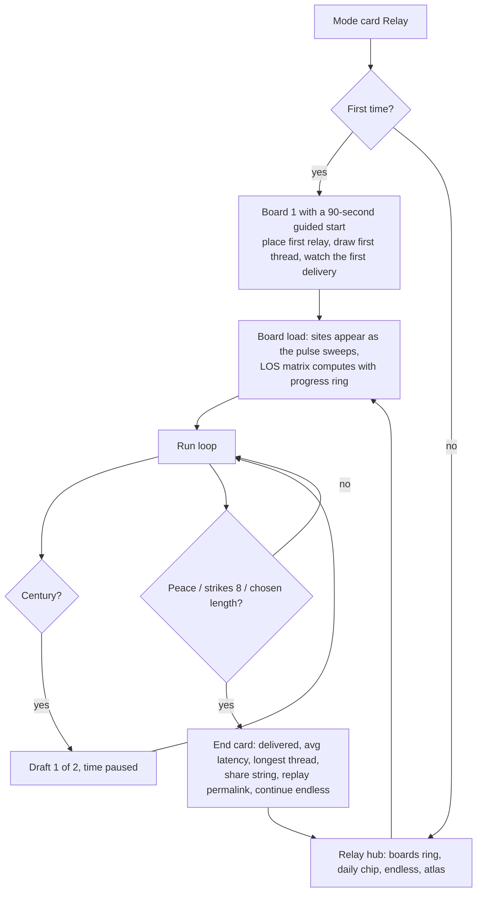
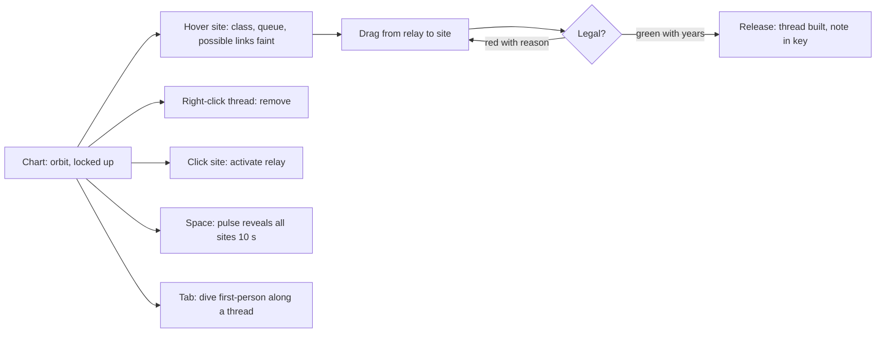

# 40 — Relay (strategy) — design hand-off

*Build second. Depends on platform WP-0 … WP-9; reuses First Light's Geodesic and LineSystem.*

> Civilisations in the fractal nebulae talk by light. You are the lightkeeper: raise relays on
> the glowing knots and string light-threads between them so every message arrives before it
> expires. Light is slow. Walls are everywhere. A black hole bends your threads around corners,
> but everything that passes near it runs late.

---

## 1. Pitch, pillars, fantasy

**Genre:** light network strategy, run-based. **Session:** 15–25 minutes per board, player-
chosen length (Subset's fix). **Comparables:** Mini Metro (demand and rationing), Slipways
(straight-line edges as the whole strategy), Into the Breach (consequences shown before
commitment), Dead Cells' unlimited-attempt daily, Terra Nil's calm ending.

Pillars:

1. **Decide on the graph, admire in 3-D.** Every decision is "connect A to B" in a chart view
   with a locked up vector; the world's 3-D-ness is what makes the graph interesting (line of
   sight through fractal structure), never what the player must manipulate.
2. **Everything is previewed.** A candidate thread turns green or red with its latency in
   years before you commit. No hidden maths (Balatro's cursed problem avoided).
3. **Gentle pressure, gentle end.** Demand grows slowly; eight expiries end the run with a
   score, not a defeat screen. Sessions end when the player chooses the board length.
4. **Physics is the ruleset.** Latency is light-time, nothing beats c; wormholes shorten paths;
   black holes bend and delay (previewable, local, optional: the research's four conditions).
5. **Fractal-native variety.** Message "shapes" are orbit-trap colours; the Julia veil's
   breathing opens and closes links; the kaleidoscope copies your relays.

---

## 2. Rules

### 2.1 Board

- One nebula arena with **N sites** (hot knots, `band: 'knots'`, N = 60–120 by board size)
  sampled from the seed; each site has a **class** (trap.x bucket into 3–4 colours: ◆ amber,
  ● teal, ▲ violet, ■ rose) and a **wake time**.
- A **LOS matrix** (N×N, sphere-traced in a worker at board load) says which pairs can be
  joined by a straight thread. Boards with a **lens** include a micro black hole
  (rs = 0.5–1 % of the arena radius) placed in the arena as part of the board's mini
  catalogue; "bent" LOS entries are computed with the geodesic tracer for pairs whose straight
  line is blocked but whose bent path around the lens is clear.
- Optional **wormhole pair**: two sites joined at zero latency, capacity 1, 50-year cooldown.

### 2.2 Entities

| Entity | Rule |
|---|---|
| **Relay** | An activated site. Routes messages. Capacity: 2 in processing, buffer 4. A relay with a full buffer for > 20 years **overloads** (one strike) and drops its oldest message. |
| **Thread** | A link between two relays with clear LOS. Length `L` ly → **latency `L` years**. Capacity 3 messages in flight per direction; a 4th waits at the relay. Removing a thread refunds it after its in-flight messages arrive. |
| **Message** | Born at a woken site with a class to deliver to: "any relay of class X" (Mini Metro's shapes). Deadline `D = 60 + 1.5 × d_straight` years, where `d_straight` is the straight distance to the nearest matching site (so detours are allowed but not infinite). Travels at c along the shortest-latency route (Dijkstra, recomputed on network change). Expiry = one strike. |
| **Demand** | Sites wake on a schedule (every 40–70 years a new site; wake order from the seed, nearest-first early, far later). Each woken site emits messages at a rate rising from 1 per 50 years to 1 per 12 years over the board's length. A message's target class is drawn with weights that avoid the origin's own class. |
| **Lens** | A node with unlimited capacity. Threads to/from it may use bent LOS. Any message passing through a relay inside the lens's **moor band** (1.2–2 rs) is delayed by the dilation factor `1/√(1 − rs/r)` (≈ ×1.6 at 2 rs, ×2.4 at 1.2 rs), shown on hover. |
| **Wormhole** | A zero-latency thread between its two sites; capacity 1; 50-year cooldown per use. |
| **Strikes** | 8 → the network falls dark: end card. |

### 2.3 Resources and the draft

Every **century** (≈ 45 s real at 1×) the player drafts **one of two** cards:
`+1 relay`, `+2 threads`, `+1 capacity token` (raises one thread or relay's capacity by 1),
`lens charge` (allows one bent thread; lens boards only), `wormhole` (once per board),
`repeater` (a relay whose buffer is 8). The draft is the strategic heartbeat (Against the
Storm, Mini Motorways' weekly tiles). Starting kit: 3 relays, 4 threads.

### 2.4 Run end and scoring

- **Campaign board:** "peace" at a delivery target (e.g. 200 delivered) → win card; the player
  may continue in endless mode.
- **Endless / daily:** play until 8 strikes or the chosen length (1,000 / 2,000 / 4,000 years).
- Score = messages delivered. Transparent; also shown: average latency, longest thread, lens
  uses. Local **average-of-ten** for the daily (never a peak board).

### 2.5 Expert modifier: old light (unlockable, off by default)

A relay's displayed queue state is as old as its light-time from the player's vantage; the
resonance pulse (Space) refreshes true state within its radius, with a cooldown. It is the
most physically honest fog of war in any game, and the most dangerous to legibility, so it
stays optional (FTL's "luck is information" lesson).

### 2.6 Out of scope

Combat, factions, money, tech trees, FTL of any kind, free-camera placement, hidden scores.

---

## 3. Content

### 3.1 Campaign (one new element per board)

| # | Nebula | Board name | New element | Size |
|---|---|---|---|---|
| 1 | Cauliflower | **Florets** | Relays, threads, classes, deadlines, the draft | 60 sites, 1,000 yr |
| 2 | Menger | **Lattice** | LOS through tunnels; threads along corridors; capacity tokens | 80, 1,500 |
| 3 | Lichtenberg | **Branches** | Linear topology; repeaters; capacity is everything | 70, 1,500 |
| 4 | Sierpiński | **Four Halls** | Self-similar sub-boards; the central void as a shortcut field | 90, 2,000 |
| 5 | Pearl Foam | **Foam** | Pearls block; every pearl an island; the wormhole | 80, 2,000 |
| 6 | Julia | **Veil** | Breathing LOS: links open and close on a shown cycle; the chart previews when a thread will next be blocked | 80, 2,000 |
| 7 | Frost | **Kaleidoscope** | Place one relay, get six (symmetry); budgets are per-set | 96, 2,000 |
| 8 | Indra's Web | **Spiral** | Long twisted paths; two wormholes | 100, 2,500 |
| 9 | Cathedral + lens | **Lantern** | The lens: bent threads around corners; moor-band delay | 100, 2,500 |
| 10 | Ouroboros board | **Frame** | A spinning lens: prograde bends cheaper than retrograde (two latency previews) | 110, 3,000 |
| 11 | The Maw board | **Beyond** | Lens + wormhole + old light (optional); the finale network | 120, 4,000 |

Boards 1–3 open at once; later boards open as any two earlier are "at peace".

### 3.2 Daily board

Seed from the date: nebula rotates; sites, wake order and demand from the seed; fractal
parameters perturbed slightly within the catalogue's safe range (e.g. Mandelbox scale
2.75 ± 0.05) so the LOS graph is new each day; 2,000 years; unlimited attempts; local
average-of-ten; share string:

```
Relay #42 · Lattice · 184 delivered · 5 strikes · 2,000 yr
```

---

## 4. Flows





---

## 5. UI / UX

### 5.1 Chart view (default)

```
┌────────────────────────────────────────────────────────────────────────────┐
│ THE MENGER LATTICE · LATTICE        year 612 / 1500     delivered 84       │
│ strikes ○○○●●●●●   next draft in 38 yr ▮▮▮▮▮▯▯                              │
│                                                                            │
│      ◆ ──────── ◉ ════ ●           (sites as class glyphs; relays ◉;       │
│        ╲        ║      ╲            threads as light; messages as pulses   │
│         ◆       ◉ ─ ─ ─ ▲ ← candidate thread (green) "14 yr"               │
│                 ║                                                          │
│                 ▲  queue ▮▮▯▯                                              │
│                                                                            │
│   inventory: ◉ relays 2   ─ threads 3   ✚ capacity 1   ◐ lens 0   ∞ wormhole 1 │
│   RMB orbit · wheel zoom · drag relay→site · right-click remove · Tab dive │
└────────────────────────────────────────────────────────────────────────────┘
```

- **Legality preview** while dragging: the thread is drawn green with its latency ("14 yr")
  or red with a one-word reason ("blocked", "too far" for threads > the board's max length,
  "full"). Time runs at 0.2× while dragging (the draft pauses it fully).
- **Queues** shown as tiny bars under relays; a relay nearing overload pulses amber (visual
  twin of the detuned hum).
- Messages are travelling pulses on threads (LineSystem `uPhase`), coloured by target class.
- The **old light** modifier dims a relay's queue bar in proportion to staleness and shows a
  small "N yr ago" label on hover.
- Draft: two glass cards centred; keyboard 1/2; the board is visible behind.

### 5.2 Dive (Tab)

First-person flight along threads for the pleasure of it (and, with old light, to see fresh
state up close). No decisions in dive; the chart is one key away.

### 5.3 Hub and end card

Boards as a ring with peace marks; daily chip with streak and average-of-ten; endless; the
Atlas with threads ("Light-time", "Line of sight", "Lensing as routing", "Time dilation",
"Frame dragging", "Wormholes") completing as elements are used.

### 5.4 Controls

| Input | Action |
|---|---|
| Right mouse drag | Orbit (locked up) · wheel dolly |
| Left click site | Activate a relay (if inventory) |
| Left drag relay → site/relay | Build a thread (preview green/red + years) |
| Right click thread | Remove (refund after in-flight messages arrive) |
| 1 / 2 | Draft choice |
| Space | Pulse (reveal sites; refresh state under old light) |
| Tab | Dive ⇄ Chart |
| `[` `]` | Time 0.5× / 1× / 2× (never faster: the game is about waiting well) |
| ? | Atlas |

### 5.5 Visual language and audio

Threads are the Voyage accent cyan with warm pulses for messages; classes are four Hubble
tints; strikes are the warn colour `#ffb347`; the lens is the real black-hole renderer
(small). Audio: a delivered message plays the target class's scale degree; threads hum at a
pitch by latency (long = low); overload detunes (`GameAudio.setTension`); the score thickens
with network size (Mini Metro's event-generated audio); peace plays the nebula's motif.

---

## 6. Teaching

- Board 1's guided start is the only tutorial: three prompts in the world (ring on a site,
  a dotted candidate thread, a pulse arriving), then silence.
- Each board's new element is introduced with the draft offering it first and the Atlas
  thread explaining it on first use (light-time: "a thread 20 ly long is 20 years late, always").
- Hints: the platform ladder, per board ("Shorter paths beat more threads"; "A relay inside
  the moor band pays ×2"; the note).
- Expert modifier unlocks only after board 9 (peace) and is explained with the Einstein-Rosen
  codex entry.

---

## 7. Technical design

### 7.1 Modules

```
src/game/relay/
  RelayMode.ts        // state machine: hub / loading / running / draft / end
  Board.ts            // BoardDef → mini catalogue (NebulaDef[] incl. optional lens hole) + arena + sites
  Los.ts              // LOS matrix worker driver; bent LOS via Geodesic; breathing LOS schedule (Julia)
  Network.ts          // graph, Dijkstra, capacities, queues, strikes (pure, seeded)
  Demand.ts           // wake schedule, emission, classes
  Draft.ts            // card pool and rules
  Daily.ts            // date seed → BoardDef with parameter perturbation
  boards/*.json
  hud/                // chart HUD, inventory, draft cards, end card, hub
tools/relay-check.ts  // headless: LOS matrix determinism, bot run, 400 dailies
```

### 7.2 Board as a mini catalogue

A board constructs its own `Simulation({ nebulae: boardDefs })` and the renderer re-initialises
for those defs at board load (shader groups compile in the background with the existing
progress callback; a lens board adds the black-hole program, ~1–2 s). The Voyage catalogue is
untouched. `BoardDef`:

```jsonc
{ "id": "menger-lattice", "nebula": "menger", "paramDelta": [0, 0, …], "arena": { … },
  "sites": 80, "lengthYears": 1500, "peaceAt": 200, "lens": null,
  "wormhole": false, "classes": 3, "wakeCurve": "near-first", "maxThreadLy": 18,
  "startKit": { "relays": 3, "threads": 4 }, "draftPool": ["relay", "threads", "capacity"] }
```

A lens board adds `"lens": { "localPos": [...], "rs": 0.008, "spin": 0.0 }`, turned into a
`NebulaDef` with `fractal: 'blackhole'` in the board's mini catalogue (the renderer draws it,
the Simulation's black-hole physics is disabled inside Relay by a mode flag so the chart camera
is not pulled).

### 7.3 LOS matrix

- N ≤ 120 → ≤ 7,140 pairs; each `Tracer.segment` ≈ 20–50 µs → < 0.5 s in a worker; bent LOS for
  blocked pairs on lens boards: one geodesic trace per pair per impact side (≤ 2 × pairs).
- Breathing boards (Julia): the matrix is recomputed at 8 phases of the veil's loop (frozen
  animation otherwise); the chart shows per-thread "open/closed" windows as a tiny arc.
- Stored as `Uint8Array` (0 blocked, 1 clear, 2 bent-only) + `Float32Array` lengths.

### 7.4 Network simulation

- 10 Hz tick; 1 tick = 1 year at 1×. Messages advance along threads by `c × dt`; relay
  processing is 2 years; queues FIFO; Dijkstra on change (≤ 40 relays, trivial).
- Deterministic from the seed; the action log (tick, action, args) replays a run →
  end-card permalink; `tools/relay-check.ts` replays 50 random bot runs twice and compares.
- Bot for testing: greedy builder (connect the most-demanded unlinked class pair with the
  shortest legal thread; draft capacity when any queue > 2). Boards must be winnable by the bot
  at peace targets with ≤ 4 strikes.

### 7.5 Rendering

Sites and relays: `GlyphSprites` (class shapes, ring for relays, bar glyphs for queues);
threads: `LineSystem` with `uPhase` pulses; the lens: the real black-hole pass scissored small;
accent lights at the four busiest relays. All in the sprite layer; no new raymarch passes.

### 7.6 Tests

LOS determinism Node/browser; bot wins boards 1–3; 400 dailies generated with site counts and
LOS density within bounds (clear-pair fraction 8–25 %; otherwise reseed); shader checks;
perf: 120 sites + 60 threads + 200 messages ≤ 0.5 ms GPU, ≤ 2 ms CPU.

---

## 8. Work packages

| WP | Deliverable | Acceptance |
|---|---|---|
| R-1 Board = mini catalogue | `Board.ts`, Simulation/Renderer re-init per board, lens hole as NebulaDef | board loads in ≤ 3 s on High; Voyage untouched |
| R-2 Sites + LOS matrix | knots sampling, worker LOS, bent LOS, breathing phases | determinism; density bounds |
| R-3 Network sim (headless) | graph, routing, capacities, demand, strikes, draft, action log, bot | bot wins boards 1–3; replay identical |
| R-4 Chart UI | orbit chart, hover info, drag-to-thread with legality preview and years, right-click remove, inventory, draft cards | preview within one frame; no decision requires 3-D orientation |
| R-5 Rendering | class glyphs, relays, queue bars, threads with pulses, lens | occlusion correct; 60 fps at max load |
| R-6 Run end + daily | end card, share string, average-of-ten, permalink replay, daily generator (build-time) | 400 dailies validated |
| R-7 Lens / wormhole / dilation | bent threads, moor-band delay preview, wormhole cooldown, spin asymmetry | latency previews match the sim within 1 yr |
| R-8 Campaign | 11 boards, guided start, peace targets, atlas threads | bot + 3 human playtests per board |
| R-9 Audio | notes by class, hum by latency, tension, peace motif | every cue has a visual twin |
| R-10 Release | demo (boards 1–2 + daily), Steam, soundtrack, supporter pack | see release doc |

---

## 9. Monetization (specific)

Premium **$12.99** (Thronefall / Slipways band) with a **replayable content-limited demo**
(boards 1–2 and the daily; Balatro's lesson: never round-limited). Web: the daily board only,
on the free site; if a portal version is ever wanted, CrazyGames (non-exclusive) not Poki.
Soundtrack app and supporter pack (thread palettes, 4K plates of finale networks, name in
credits) at launch. Expansion boards (new nebulae or a second lens type) only after proven sales.

---

## 10. Risks and mitigations

| Risk | Mitigation |
|---|---|
| 3-D graph illegible | Locked-up orbit, ghost x-ray, small boards, LOS faint web on hover, class glyphs with distinct shapes (not only colours) |
| Snowball / dead time | Draft every century, demand curve tuned so peace targets land at 15–25 min, player-chosen length |
| Old light breaks trust | Off by default; explicit staleness labels; pulse refresh |
| Lens boards confuse | Bent threads drawn as curves with the bend visible; latency preview includes the moor delay; one lens per board |
| "Mini Metro clone" | The fractal LOS, light-time and lensing are visibly the game; the campaign's one-new-element-per-board keeps it honest |
| Renderer re-init per board | Background compile with progress; keep programs cached by key (existing `nebulaMaterialKey`) |

---

## 11. Open questions

- Wormhole as a draft card vs a fixed board feature: start fixed (boards 5, 8, 11), draft
  later if endless mode needs it.
- Time speeds: capped at 2× by design; if playtests want faster waiting, add 4× in endless only.
- Should delivered messages leave a faint persistent glow on sites ("traffic history")? Cheap
  and pretty; decide after R-5.
