# Fractal Nebulae — Game Design Hand-offs

*Prepared 2026-10-02. For the models (and people) who will turn the Voyage into games.*

Fractal Nebulae today is a relaxing, educational flight through raymarched 3-D fractal nebulae
and two lensing black holes, with generative music and a science codex
([README](../README.md), [ARCHITECTURE](../ARCHITECTURE.md)). It is a toy: beautiful, honest,
and without goals. This folder specifies three games built on it, the shared platform they
need, and the release plan. Six research reports (24,000 words, ~450 cited sources) sit in
[`research/`](research/); their findings are condensed below so you do not have to re-read them.

## How to use this folder

| Read this | When |
|---|---|
| This README | Always first. Decisions, digest, build order, working rules. |
| [`10-platform.md`](10-platform.md) | Before implementing any game: the shared systems (modes, free cursor, overview camera, placement, site sampler, tracer, line renderer, save/daily/share, atlas, hints). |
| [`20-first-light.md`](20-first-light.md) | The puzzle game. **Build this first.** |
| [`30-nursery.md`](30-nursery.md) | The simulation game. |
| [`40-relay.md`](40-relay.md) | The strategy game. |
| [`50-release-and-monetization.md`](50-release-and-monetization.md) | Pricing, stores, wrapper, licence, launch sequence. |
| [`research/`](research/) | The evidence. Cite it when you change a design rule. |

Each concept document has the same shape: pitch → pillars → rules → content → flows → UI/UX
→ teaching → technical design → work packages with acceptance criteria → monetization → risks →
open questions. Work packages are sized for one agent session each and ordered by dependency.

## Decisions taken (2026-10-02, with the owner)

1. **Build order:** First Light (puzzle) → Relay (strategy) → Nursery (simulation). All three
   are fully specified; the platform work is shared and done once.
2. **Distribution:** the Voyage and the First Light daily stay **free on the web** (the
   funnel). Full games ship as **premium Electron builds on Steam and itch** at $9.99–16.99
   with a soundtrack app and a supporter pack. GitHub Pages forbids ads and checkout, so the
   free site never carries commerce; it links out.
3. **Licence:** the repo stays public and gets a **source-available licence** (PolyForm
   Noncommercial 1.0.0) plus a `THIRD-PARTY-NOTICES` file (three.js MIT, Tone.js MIT, fonts
   OFL). People can read and learn; commercial rights stay with the owner.
4. **No backend in v1.** Progress in `localStorage` (exportable JSON), dailies seeded by date,
   Wordle-style share strings, permalinks for "stand where I stood". Leaderboards, naming
   ledgers and co-op are explicitly later.

## The three concepts at a glance

| | **First Light** (puzzle) | **Nursery** (simulation) | **Relay** (strategy) |
|---|---|---|---|
| One line | Bend a star's light around fractal walls, off pearls and around black holes to ignite dark seeds. | Midwife a star-forming region: seed cores, send shocks, shade gas, and let a cluster blaze. | Mini Metro on a fractal visibility graph: relays on glowing knots, light-threads with real latency, messages with deadlines. |
| The one verb | Place a mass (a point). | Touch a site (seed / shock / shade). | Draw a thread between two relays. |
| Where decisions live | A point on your view ray (never 3-D orientation). | A snapped site on the fractal. | A graph edge, previewed green/red before commit. |
| Session | 3–8 min per puzzle; 64 authored puzzles (5–8 h) + a 3-minute daily. | 20–40 min commissions; open sandbox. | 15–25 min runs; campaign of 11 boards + daily board. |
| The science it shows | Gravitational lensing, photon sphere, Einstein rings, frame dragging, wormholes, reflection. | Jeans collapse, Strömgren spheres, photoevaporation and pillars, triggered star formation, the IMF, supernovae. | Light-time latency, line of sight, lensing as routing, gravitational time dilation. |
| Fractal-native hook | Kaleidoscope folds copy your masses; self-similar "Deep" variants of levels. | Geometry dictates dynamics: Menger spreads, Apollonian isolates, the Tree chains. | Trap-colour "message shapes"; breathing Julia veils open and close links. |
| Price (Steam) | $12.99 premium + free web daily | $12.99–14.99 + "name a star" supporter tier + Dome/Pro later | $12.99 + replayable content-limited demo |
| New systems beyond the platform | Beam tracer with GR deflection, level schema, solver, daily generator. | Site cellular automaton, 3-D gas mask in the nebula shader, star voices. | Board = mini catalogue, LOS matrix, routing/demand sim, draft. |

## Research digest: what the evidence says

Every rule below is backed in `research/`; the file is named in brackets.

1. **Toys die at an hour; goals keep people.** Townscaper Metacritic 63 ("finish in the first
   hour"), Tiny Glade median session 54 min, Universe Sandbox 96 % positive but ~372 concurrent
   players, SpaceEngine's top churn driver is "repetitive/boring". Relaxing games that retain
   (PowerWash, Dorfromantik, Balatro, Big Walk) all wrap calm inside a completion state, a score
   or a shared daily prompt. [04, 02]
2. **Knowledge is the best reward.** Outer Wilds ("the only powerup is knowledge", 95 % of
   ~109k reviews) is the most praised exploration design of the decade; its rumour map with
   asterisks on unexhausted locations is why knowledge-gating works. The codex is our ship log.
   Every unlock must show the maths and the musical rule it drives (Universe Sandbox's "ironic
   flaw" is explaining nothing). [01, 02, 04]
3. **The free daily is the proven web format.** NYT Games 11.2 B plays in 2025; Wordle: one
   puzzle a day, three minutes, a spoiler-free share grid, no account. Poki's 2026 report:
   playable in ~3 s, small payload, 11–20-minute sessions, 62 % of web players later buy a game
   they met on the web. The browser build is the incubator; the Steam build must be visibly
   upgraded (Roottrees $1 M vs Tiny Kingdom 107 reviews). [01, 04, 05]
4. **Showcase, do not stump.** Blow/ten Bosch, Traynor (Parabox: "to showcase/communicate, not
   challenge/stump"), Elyot Grant (eureka over fiero), Monument Valley ("less game, more
   experience"). Eliminate accidental solutions (Viewfinder's brute force sank it to 61 %); a
   great mechanic does not rescue shallow puzzles (Superliminal "3/10 difficulty"). [01]
5. **Disorientation is our worst risk.** Self-similar 6-DoF space is the hardest case: Manifold
   Garden needed 2,000 playtest hours and landmarks; Cocoon's top complaint is back-and-forth
   traversal; Outer Wilds' controls and "stuck" are 40 % of its negative weight. Prerequisites:
   small arenas, an overview camera, a beam or thread as landmark, one-key return to vantage,
   comfort options, no forced camera motion. [01, 02, 03]
6. **Never decide in free 3-D.** No light strategy game has succeeded by asking players to
   reason in 3-D; Homeworld locked the camera and kept a shared "up", Nebulous players order
   ships 45° wrong, Slipways and Stellaris project decisions onto a graph. Fly in 6-DoF, decide
   on a point, a site or an edge. [03]
7. **Short, player-sized runs; information up front; gentle pressure.** Balatro < 20 min,
   Dead Cells 20–45, FTL's "luck" complaints are information complaints, Into the Breach shows
   consequences before commitment. Daily seeds with unlimited attempts and average-of-ten
   boards, never peak-score boards (Spelunky's distortion). [03]
8. **Relativity is strategic only when it changes a schedule, is previewable, budgeted, local
   and optional.** Achron was "stunningly inventive" and failed on legibility. [03]
9. **Tech-first games with thin loops fail; geometry puzzles outperform exploration.**
   Claybook (world-class SDF physics) is Mixed 61 %; Yedoma Globula's dev: "not much actual
   gameplay"; every Steam fractal viewer has ≤ 152 reviews. Parabox 99 %, Manifold Garden 95 %,
   Superliminal 93 %, and the one fractal hit, Fractal Block World (98 %/1,510), wraps the
   fractal in a quest, currency, upgrades and a map. Marble Marcher (the closest ancestor) was
   30–45 min long, went viral once, and its community's first act was a level editor. [06]
10. **Cheap fractal-native mechanics exist.** Exact CPU-mirrored collision (we have it) is the
    precondition; surface placement is gradient descent on the DE; path-finding is a coarse DE
    grid + A*; orbit traps are free per-point "materials"; painting by trap bucket costs zero
    memory and paints every self-similar sibling; soft shadows are one extra march; hybrid
    rendering (raymarched world, rasterised sprites composited by depth) is the proven pattern.
    Hand-pick parameter regions where the DE is well-behaved (CodeParade: "the distance
    estimator is not good enough for most fractals"). [06]
11. **Scanning must change the world.** Mass Effect 2 and Jett are the documented failures;
    In Other Waters and Fract OSC succeed because every scan adds a plate, a voice or a map link.
    Music as verb is proven (Rez, Mini Metro's event-generated audio, Fract OSC's "wake a
    dormant synth world"). [02]
12. **Share artefacts without servers.** Plate mode (pause, orbit cam, FOV, hide HUD, hi-res
    export) plus a permalink encoding seed and camera is days of work and the best marketing a
    small game ships; community content must survive server death (Sound Shapes lost
    everything). Noctis ran a shared starmap via curated text files. [02, 04]
13. **Market lanes.** Growing: roguelite runs, idle/incremental, chill job sims, web/HTML5
    (+170 % YoY), co-op. Saturated: "cozy" (1,041 releases in 2026, 11 % reach 1k reviews),
    deckbuilders (~5 %), puzzle platformers (1.5 %), turn-based strategy and city builders
    (falling). Space and education tags are evergreen but thin; r/space has 20 M members,
    Outer Wilds 2 M+ buyers, KSP's audience is intact and starving. Do not use the "cozy" tag. [04]
14. **Ship small, cheap, finished; iterate in public.** PEAK (one-month jam), RV There Yet?
    (8 weeks) versus KSP2 and Star Citizen. The median Steam indie grossed ~$249 in 2025 and
    65.9 % under $1,000; the free web app is the lever from Bronze toward Silver. [04, 05]
15. **Monetization that players accept.** Free web demo → cheap Steam build (Townscaper
    380k copies at $5.99, Cookie Clicker 92k reviews at $4.99, Melvor Idle JS on Steam at
    $9.99). Soundtrack apps attach 0.1–3 %, supporter packs 2–7 % at $4–7. Portal ads pay
    $200–2,000/month at best and 37 % of US desktop users block them: not for an art-first
    product. Electron + steamworks.js is the wrapper (Tauri is wrong for Deck). [05]

## Shared platform (summary; full spec in `10-platform.md`)

Game modes plug into the existing `loading → start → flying ⇄ paused` shell. The platform
adds: a **free-cursor state** (no pointer lock, mouse as a pointer, Esc still pauses); an
**overview camera** (orbit around a focus with a locked "up", using the ghost x-ray sphere to
see into structure); a **placement primitive** (a point on the view ray with a depth wheel,
optionally snapped to a candidate site, legality previewed before commit); a **site sampler**
worker (gradient-descent surface points, orbit traps on the CPU, blue-noise thinning, kNN
graph); a **tracer** (sphere-traced line of sight; a beam integrator with Schwarzschild
deflection, reflection and filters); a **line and glyph renderer** in the depth-tested sprite
layer; **accent lights** in the nebula shader; **save, daily seeds, share strings and
permalinks**; an **atlas** (codex with loose-thread markers); an opt-in **hint ladder**;
**audio hooks** (notes in the current key, added voices). Everything the three games need and
nothing more.

## Build order and roadmap

```mermaid
gantt
  title Roadmap in agent sessions (not calendar weeks)
  dateFormat X
  axisFormat %s
  section Platform
  Platform WP-0 to WP-5 shell cursor overview placement sampler tracer lines :p1, 0, 6
  Platform WP-6 to WP-10 lights save daily share atlas hints audio plate     :p2, 6, 10
  section First Light
  FL-1 to FL-4 tracer levels placement rendering   :f1, 4, 9
  FL-5 to FL-6 chapter 1 solver daily              :f2, 9, 12
  FL-7 to FL-8 chapters 2-9 and black holes        :f3, 12, 20
  FL-9 to FL-10 polish Electron Steam              :f4, 20, 24
  section Relay
  R-1 to R-3 board LOS matrix network sim          :r1, 14, 18
  R-4 to R-6 chart UI rendering draft daily        :r2, 18, 23
  R-7 to R-10 lens wormhole boards audio release   :r3, 23, 30
  section Nursery
  N-1 to N-4 sampler sim core sprites gas mask     :n1, 22, 28
  N-5 to N-8 tools audio commissions atlas         :n2, 28, 34
  N-9 to N-10 sandbox tuning release               :n3, 34, 38
```

Milestones that matter:

- **M1 "Magic test"** (after FL-5): six authored Cauliflower puzzles playable in the browser.
  Five narrated video playtests (Parabox method). Go/no-go on the mechanic before authoring 58
  more levels.
- **M2 "Daily live"**: the First Light daily on the free site with share strings. Watch for
  organic traffic (r/space, Hacker News, fractal communities) before any store page.
- **M3 "Steam page + demo"**: a content-limited demo (chapter 1 + the daily) in a Next Fest;
  target 7–10k wishlists before launch (Zukowski).
- **M4 "First Light 1.0"** on Steam and itch, with soundtrack app and supporter pack.
- Relay and Nursery follow the same four milestones each, reusing M2's funnel.

## Working agreements for agents

- Read `ARCHITECTURE.md` §0 before touching anything: world unit = 1 ly, camera-relative
  rendering, log depth, **no `glslVersion`**, jittered full-screen passes, allocation-free
  per-frame code, exact CPU/GPU distance-estimator mirrors. Validate every shader with
  `npx tsx tools/check-all-shaders.ts`. Re-run the collision-safety harnesses after touching
  flight.
- A module owner writes only their own files. Contracts live in `src/core/types.ts`; extend
  them there and in `ARCHITECTURE.md` together. Game code lives under `src/game/<mode>/`;
  shared game systems under `src/game/platform/`.
- Every game system has a **headless harness** (`npx tsx tools/<name>.ts`) before it has a
  UI: tracer determinism, solvability of every authored level, 400 generated dailies, network
  sim with a scripted bot, cellular automaton invariants. The browser pane throttles rAF to
  ~1–2 fps and refuses pointer lock, so use the dev rig in `tools/devtools.js` and drive the
  sim programmatically for visual checks.
- Design rules are not decoration. If you change one ("no timers", "decisions on a point"),
  cite the research that justifies it and update the concept doc in the same change.
- Determinism: all generation and simulation from a seed (`mulberry32`), fixed tick rates,
  positions quantised before any threshold decision. Dailies are generated at build time by a
  Node script with the same JS distance estimators and shipped as small JSON files; a runtime
  generator is the fallback.
- Tone: the Voyage's voice is calm, precise and curious (see `src/content/codex.ts`). No
  "gamer" language in-world: no XP, no combos, no alarms. Numbers only where they teach.
- Accessibility: every audio cue has a visual twin; FOV and sensitivity remain user settings;
  Deck-readable text (≥ 9 px at 1280×800) once the Electron build exists.

## Open questions (not blocking)

- **Naming.** Working titles are *First Light*, *Nursery*, *Relay*, each sub-branded under
  Fractal Nebulae. "First Light" is a real astronomy term (a telescope's first observation) and
  is used by other products; a trademark check is due before the store page.
- **One app or three?** The platform assumes one codebase with modes selected on the start
  screen (and by `?mode=` URL). Steam can still sell them as separate apps built from the same
  repo with a mode whitelist. Decide at M3.
- **WebGPU.** Baseline since January 2026; three.js r171+ has `WebGPURenderer` with WebGL2
  fallback. Not needed for any concept; revisit only if a game is GPU-bound on Low.
- **Controller scheme.** Required for Deck Verified; the placement primitive maps to a stick +
  trigger naturally, the overview camera to the right stick. Design when the Electron build starts.

## Glossary

- **Arena**: a bounded play region inside one nebula, in nebula-local coordinates.
- **Site**: a sampled point on or near a fractal surface with its orbit-trap values; candidate
  for placement (seed, relay, star).
- **Hot knot**: a site whose trap.w (emission mask) is high: the glowing star-forming cores.
- **Trace**: a sphere-traced segment test against the world distance estimator.
- **Beam**: a polyline produced by the First Light tracer (deflection, reflection, filters).
- **Thread**: a Relay link between two relays; valid only if the trace is clear.
- **Plate**: a captured image + camera permalink stored in the atlas.
- **Loose thread**: an atlas entry with unexhausted sub-entries, marked with an asterisk.
